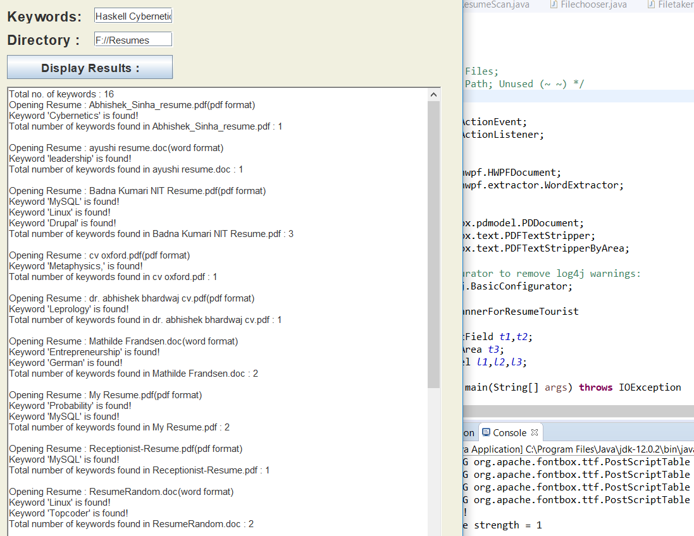

# Resume-Keyword-Scanner
Java program which scans all files from any specified directory and reads the ones with .doc and .pdf extensions among them, extracting desired keywords and returns keywords found with the weightage of resume. Can be used as a resume ranker among a list of resumes. (might add a GUI later)

```
Files to be uploaded on 15/09/19. within UTC:2-10:00.
```



Support for DOC/PDF:
---
Added via Apache POI and PDFBox (jar) libraries with all dependencies clear by the latest build version. 

Issues:
---
(1) POI HPWF's extractor with fileData (String array) as object has access to reading the file by characters, and no other methods that support reading words. <br>
Status: Solved by extracting contents into another file in local workspace and reading from that.

(2) PDF Document Entry function gives log4j warnings. <br>
Status: Solved by using a Basic configurator for that function dec. line only. (Warning free console)

(3) PDF Encryption rule-pass check. <br>
Status: Added Encryption check and imported TextStrippers based on area. 

(4) Buffreader has only LineReader method hence all scanning is line-based which returns multiple instances of keyword-findings and weightage. <br>
Status : All string read methods in doc follow line reading and hence it is difficult to resolve this. (tried with streamers, buffers, files-class etc. but same result) Temporary Solution - write in a line with no carriage return or similar line breaking (eof) characters. (like enter) 
>> Update : Solved by splitting directly from filedata.

(5) PDF/DOC Recognition in a File Directory. <br>
Status: Solved by using FileFilters.

(6) Files iteration / Reading all files in a directory: <br>
Status: Solved by implemented a for each loop iterating through the files in a directory with only pdf/doc listing as specified in Filechooser class and then differentiating from those two based on their ending name.

Extras
---
Added Application Interface (Jframe+Swinger GUI) to take custom keywords and directory as input. <br>
Output will be displayed on three platforms - the eclipse console, a word document and on the application result textfield. <br>
Added support for Latex.
 
